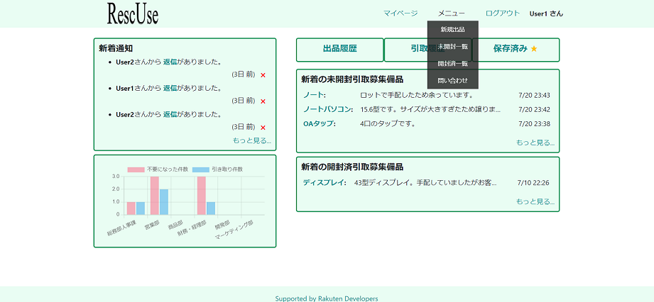
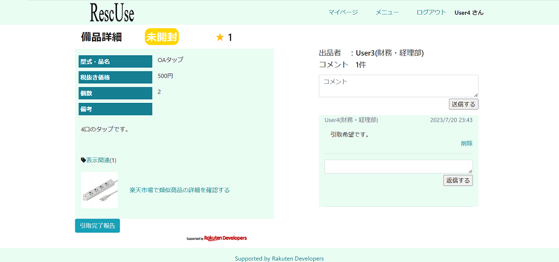

# RescUse

  
https://pf-rescuse.com/
## サイト概要
社内で不要となった備品の転用先を探すアプリケーション

### サイトテーマ
備品手配に対する意識改革

### テーマを選んだ理由
　前職では社内で使用する備品やお客様向けに出荷する機器の手配に携わっていましたが、
案件の仕様変更に伴い手配開始後に不要となってしまう場面が多々ありました。
不要になった機器については次回他の案件で必要となるまでは手配担当の部門で保管をしていました。
　他の案件向けに提案が出来なかった機器は時間の経過と共に資産価値がなくなり、最終的には処分ということも多くありました。
手配部門からは直接お客様に向けた提案を行うことも難しいため、
営業担当者間で、社内で余っている機器の情報を交換して案件向けに提案が出来れば良いと考えていました。

　また、社内使用の為に手配をしたがスペックが合わず不要となった機器、
社内で使用していたけれど後々不要となった機器、を他部署に転用するといったシーンも多々ありました。
こちらについても、それぞれの部署間で余っている機器の情報を交換出来れば新規手配が不要となり経費の削減につながると考えていました。

今回はより多くの企業が利用の対象となるよう、社内備品の投稿に絞ったアプリケーションとなっており以下の機能が携わっています。

*1.手配依頼をした部署が責任をもって活用先、転用先を探す場となる。*

*2.不要としてしまった備品の件数、社内の機器の引き取りによりコストを削減できた実績を部署ごとにグラフ化することで、部署内で一丸となっての意識向上を狙う。*

これらが手配開始前により慎重な検討をすることを意識付け、社内の無駄の削減にも力添えすることを願っています。

### ターゲットユーザ
企業

### 主な利用シーン
- 社内の備品として手配を開始した後に不要となった機器があればその譲り先を探す。
- 備品として部門内で利用した後に不要となった機器があればその譲り先を探す。
- 未使用のまま不要としてしまった件数、引き取りを行えた件数のグラフを表示して、
　社内で無駄なく備品を扱えている部門、無駄を出してしまっている部門を可視化させる

## 設計書
　[ER図](https://app.diagrams.net/#G1GqhmY6fKODxTdR_TeFBp8qMigQ2boo7u)  
　[ワイヤーフレーム](https://www.figma.com/file/xFzK5oPiVT7EiODVQT8TMH/PF?type=design&node-id=0-1&mode=design&t=rEN90O80gMap3N8d-0)  
　[アプリケーション詳細設計](https://drive.google.com/drive/my-drive)  
　[テスト仕様書]( https://docs.google.com/spreadsheets/d/1Q3hx1qO7A4EdDU9I52fIsnM2YJB0DTwo/edit#gid=1538903331)  
## 実装機能

- 管理者側
  - 退職した社員を退会させる機能
  - 不適切な投稿を削除する機能
  - 部署の管理機能
  - 備品のタグによる管理機能
  - ユーザー及び投稿の検索機能

- 利用者側
  - 手配開始しているが不要になった備品(未使用品)の情報投稿
    - 投稿への質問を行えるコメント機能
    - 検討中の機器を保存するブックマーク機能
    - 投稿へのコメント、コメントへの返信への通知機能
    - 備品引き取り記録の登録機能
    
  - 納入後に余った備品(開封済、使用済品)の情報投稿
    - 投稿への質問を行えるコメント機能
    - 検討中の機器を保存するブックマーク機能
    - 投稿へのコメント、コメントへの返信への通知機能
    - 備品引き取り記録の登録機能

  - その他
    - 出品件数と引き取り件数をグラフ化
    - タグ検索機能
    - 気になる備品のお気に入り登録機能

## 開発環境
- OS：Linux(CentOS)
- 言語：HTML,CSS,JavaScript,Ruby,SQL
- フレームワーク：Ruby on Rails
- JSライブラリ：jQuery
- IDE：Cloud9

